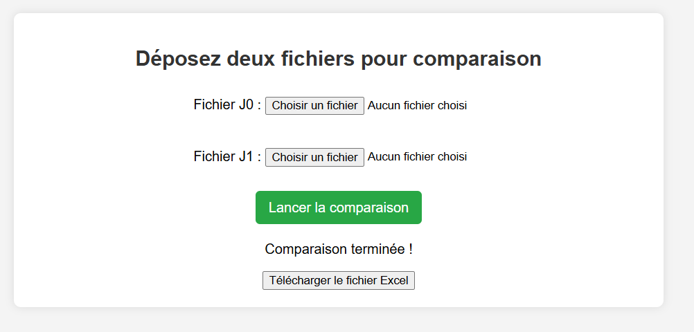

# 🚀 Comparaison de Fichiers


> Un outil simple en Python permettant de comparer deux fichiers texte et d’exporter les différences dans un fichier excel pour analyse.

---

## 📸 Aperçu



---

## 📥 Installation

1. Clonez le projet :
   ```sh
   git clone https://github.com/user/repo.git
   cd repo
